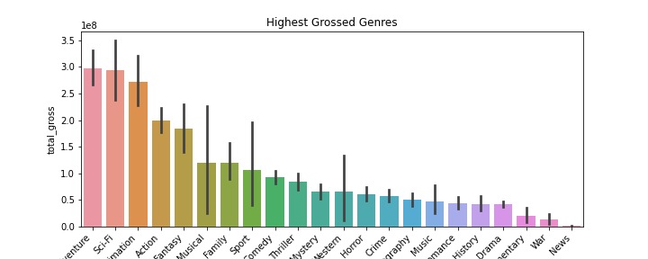
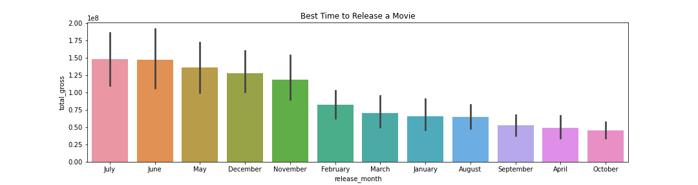
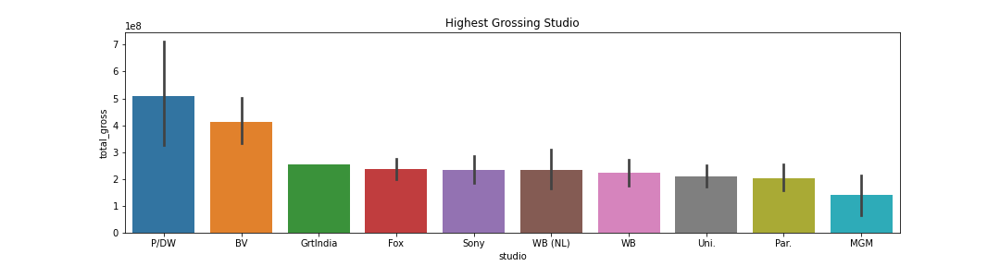

# Title

**Authors**: Alec Hing

## Overview

Microsoft has decided to get into the movie making business due to the popularity of original video content from other studios. Their main problem they are a technology company new to the movie scene and need insight into this new realm of business. Past data will be used from multiple data sources that show some of the most popular movies' relevant information. Combining the necessary information,
3 questions will be answered to determine important financial decisions for Microsoft's new movie studio. Those include, what is the highest grossed genre, the best time to release a movie, and who are the highest grossed studios today.

## Business Problem

Microsoft's unfamiliarity within the movie realm requires analysis and insight as the best approach that makes financial sense for their new studio. Determining what is necessary information and what is irrelevant to the data questions are the pain points of this project. Additionally conversion of certain data types and knowing when to drop useless/redundant information will also be a pain point.
The above mentioned business questions were chosen after deciding on which data sources to use, and which had important financial information that can be used. These questions will prove to be important because as a new studio, Microsoft cannot risk having a rough start. These will questions will also help show where other studios/type of films have failed.

## Data

The date used in this analysis was gained through a data zip file through a GitHub repository. The intended types of data that will be used are: strings, integers, floats, dataframes, and datetime variables that will be manipulated in order to answer the business questions mentioned in the overview. Through multiple packages in python, data will be stored, dropped, converted to present visuals to help illustrate the best financial decisions.

## Methods

This data was prepared by first previewing all the provided data tables. Tables were selected for analyzing depending on the information available in them. Tables with financial information was especially used for future models that would be made. Once the appropriate tables were chosen, they were joined to see the correlations I would need for graphing purposes. Before graphing could be done, the combined data needed to checked for duplicates and NaN values. Once these were removed, it made for a table with cleaner data. This approach was necessary because the objective was to provide a financial decision for Microsoft. Determining the right dollar amount when compared with fields like genre, release data, and which studios are the most succussful was an important step. Once averages and sums were made, it was time to plot the data and see where there was a meaningful result. Numpy was used to find averages, pandas was used for gathering data in a dataframe format, and matplotlib & seaborn were used to plot the cleanned data.

## Results


### Genre vs. Total Gross



Genre vs. Total Gross shows that Adventure, Sci-Fi, Animation, Action, and Fantasy are the highest grossed genres.
Recommendation: Making these types of movies will be popular among consumers

### Relase Month vs. Total Gross



Plotting Month vs. Total Gross shows that July, June, May, December, and November are the best times to release a movie.
Recommendation: Start casting, budgeting, filming so a movie can be released for these popular months


### Studio vs. Total Gross



Studio vs. Total Gross shows that P/DW, BV, GrtIndia, Fox, and Sony are the top 5 most successful studios respectively.
Recommendation: Doing business with these top studios would be beneficial 


## Conclusions

After analyzing the data provided to me, I can make several recommendations that would prove beneficial.
One, the top 5 highest gross genres are: Adventure, Sci-Fi, Animation, Action, and Fantasy respectively. Making one of these types of films will have a higher chance that the consumer will watch them.
Second, the best times to release movies that have shown to yield the highest gross would be: July, June, May, December, or November. Further research can be done with a marketing team as to why these months are the most popular.
Finally, I would recommend doing business with these top studios since they have the highest grossed films: P/DW, BV, GrtIndia, Fox, and Sony respectively.
There is potential room for improvement with my analysis because it does not account for casts the audience may prefer or a certain director/writer known to make a lot of hits. To further improve this project, I would use net profit instead of total gross worldwide to see exactly how much money a film made. This was further show how successful a movie was.

## For More Information

Please review our full analysis in [our Jupyter Notebook](./dsc-phase1-project-template.ipynb) or our [presentation](./DS_Project_Presentation.pdf).

For any additional questions, please contact **Alec & ahing619@gmail.com**

## Repository Structure


```
├── README.md                           <- The top-level README for reviewers of this project
├── students.ipynb                      <- Analysis in of this project in Jupyter notebook
├── DS_Project_Presentation.pdf         <- PDF version of project presentation
├── zippedData                                <- Both sourced externally and generated from code
└── images                              <- Both sourced externally and generated from code
```
